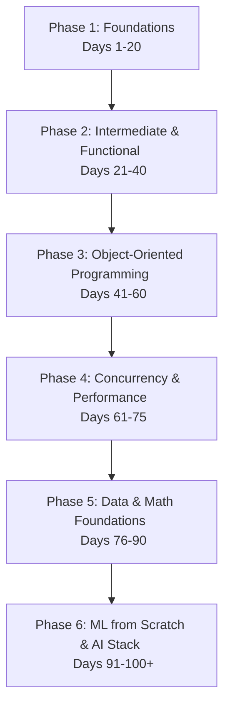

# 🐍 100 Days of Python: Master Class for AI Engineers

Welcome to your structured 100-day Python learning plan. This program is designed specifically to help you build **muscle memory** and master the language from its absolute foundations up to the advanced patterns required for high-level **AI Engineering**.

## 📅 Course Philosophy: The Socratic Method
You will not just read code; you will **discover** it. As your Socratic AI guide, my role is to:
1. Provide a daily topic and key conceptual insights.
2. Ask thought-provoking questions instead of just giving you the answers.
3. Challenge you with exercises that force you to write code from scratch.
4. Guide you through debug cycles to build a deep mental model of how Python works under the hood.

---

## 🗺️ The 6-Phase Curriculum

### 🟩 Phase 1: Foundations of Python Programming (Days 1–20)
*Build the foundational muscle memory for core syntax, variables, and logic.*
- **Days 1–3**: Environment Setup, Basic Syntax, Variables, Memory Models, and Dynamic Typing.
- **Days 4–7**: Control Flow, Conditional Logic, `for`/`while` Loops, and Nested Structures.
- **Days 8–11**: Functions: Parameters, `*args`, `**kwargs`, Closures, Scope (`global` vs `nonlocal`).
- **Days 12–15**: Data Structures I: Lists, Tuples, Sets, Dictionaries, and their Time Complexities.
- **Days 16–18**: String Manipulation, Formatters (f-strings), Regex Basics.
- **Days 19–20**: File I/O (`pathlib`), Error and Exception Handling (`try`/`except`/`finally`).

### 🟨 Phase 2: Intermediate Python & Functional Paradigms (Days 21–40)
*Learn to write idiomatic, elegant, and declarative Python.*
- **Days 21–23**: Comprehensions (List, Dict, Set) and Generator Expressions.
- **Days 24–27**: Functional Programming: `lambda`, `map`, `filter`, `reduce`, `zip`, `enumerate`, `any`/`all`.
- **Days 28–31**: Advanced Iterables: Generators, `yield`, `iter()`, `next()`, Custom Iterators.
- **Days 32–35**: Decorators: High-Order Functions, Decorator Factory, Class Decorators, preserving metadata (`functools.wraps`).
- **Days 36–40**: Standard Library Mastery: `collections` (Counter, defaultdict, deque), `itertools`, and `functools`.

### 🟦 Phase 3: Object-Oriented Programming (Days 41–60)
*Master software architecture and reusable design patterns.*
- **Days 41–43**: Classes, Objects, Attributes, Methods, and the `self` parameter.
- **Days 44–47**: Pillars of OOP: Encapsulation (naming conventions, property decorators), Inheritance (MRO, `super()`), and Polymorphism.
- **Days 48–52**: Dunder (Magic) Methods (`__init__`, `__str__`, `__repr__`, `__len__`, `__getitem__`/`__setitem__`, Operator Overloading).
- **Days 53–56**: Context Managers (The Resource Acquisition Is Initialization pattern, `__enter__`/`__exit__`, and `contextlib`).
- **Days 57–60**: Abstract Base Classes (ABCs), Metaprogramming Basics (dynamic class creation via `type`), and Design Patterns in Python.

### 🟪 Phase 4: Advanced Python & Performance Optimization (Days 61–75)
*Understand performance, safety, and scale.*
- **Days 61–64**: Concurrency I: Multithreading, the GIL (Global Interpreter Lock), Race Conditions, and Locks.
- **Days 65–68**: Concurrency II: Multiprocessing, CPU-bound tasks, Inter-Process Communication (IPC).
- **Days 69–72**: Concurrency III: Asynchronous Programming (`asyncio`, Event Loop, Coroutines, `async/await`).
- **Days 73–75**: Memory Management (Ref Counting, GC), Code Profiling (`cProfile`, `memory_profiler`), and Vectorization.

### 🟧 Phase 5: Data Engineering & Mathematical Foundations (Days 76–90)
*The mathematical and data-wrangling engine behind AI.*
- **Days 76–80**: NumPy: Array creation, Vectorization, Broadcasting, Matrix Operations, and Linear Algebra.
- **Days 81–85**: Pandas: Series, DataFrames, Data Manipulation, Slicing (`loc`/`iloc`), Merges, Aggregations.
- **Days 86–90**: Data Visualization (Matplotlib/Seaborn) and Exploratory Data Analysis (EDA) workflows.

### 🟥 Phase 6: Machine Learning Foundations & Modern AI Stack (Days 91–100+)
*Apply everything you learned to build AI systems from the ground up.*
- **Days 91–93**: Implementing Algorithms from Scratch: Linear Regression, Logistic Regression, or KNN using only Python & NumPy.
- **Days 94–96**: Deep Learning Fundamentals: Tensors, Autograd, and Custom Network Architecture in PyTorch.
- **Days 97–98**: Custom PyTorch Training Loops, Dataset Loaders, and evaluation metrics.
- **Days 99–100**: Modern AI Integration: API Interaction (Gemini/OpenAI), function calling, implementing a ReAct Agent loop from scratch, and deploying it with FastAPI.

---

## 🛠️ How to Succeed
1. **Dedicate 1 Hour Daily**: Consistency is more important than duration.
2. **Never Copy-Paste**: Type out the code character-by-character to build mechanical muscle memory.
3. **Debug Manually First**: If you see an error, read the stack trace carefully before asking for help.
4. **Answer the Socratic Prompts**: Write down your thoughts or explain your code before running it.

Let's embark on this journey!
